# Electrolux Products - Gerenciamento de Produtos

## Descrição do Projeto

Este projeto é uma aplicação Angular 19 desenvolvida como parte da prova técnica para o cargo de Analista Senior – Front-End da Electrolux. 
O objetivo é exibir e gerenciar uma lista de produtos, permitindo listagem, filtragem, adição, atualização, deleção e visualização de detalhes dos produtos,
utilizando boas práticas de desenvolvimento Angular.

## Funcionalidades Implementadas
- Listagem de Produtos: Exibição de uma tabela com os produtos, incluindo as colunas Nome, Preço, Categoria e um botão "Detalhes".
- Filtragem de Produtos: Campo de busca para filtrar produtos pelo nome no cabeçalho.
- Adição de Produtos: Formulário para adicionar novos produtos com campos Nome, Preço e Categoria.
- Detalhes de Produtos: Modal ou seção na página exibindo as informações completas do produto ao clicar em "Detalhes", incluindo também botões para atualizar ou deletar o produto.
- API Simulada: Utilização do pacote JSON-server para simular uma API REST com endpoints para GET /products e POST /products.
- Responsividade: Interface responsiva, adequada para diferentes tamanhos de tela.

## Tecnologias Utilizadas
- Framework: Angular 19
- Linguagem: Typescript
- Estilos: Tailwind CSS
- Simulação de API: JSON-server

## Como Rodar o Projeto Localmente
1. Pré-requisitos:
   - Node 18.19.1 ou superior
   - Angular CLI instalado globalmente
   - NPM ou Yarn como gerenciador de pacotes
2. Passos para Configuração:

Clone o repositório
```bash
git clone https://github.com/Suetam94/electrolux-products
cd electrolux-products
```

Instale as dependências
```bash
npm install
```

Inicie a aplicação (JSON-server e Angular)
```bash
npm run start
```

3. Acesse o projeto:
   - Frontend: http://localhost:4200
   - JSON-server: http://localhost:3000

## Testes
Para garantir a qualidade do código e o correto funcionamento da aplicação, foram implementados testes utilizando o framework Karma e Jasmine,
fornecidos nativamente pelo Angular.

- Cobertura de Testes:
  - Componentes principais, como a tabela de produtos e o modal de detalhes, possuem testes unitários para validar a renderização e a interação com o usuário.
  Serviços possuem testes para verificar as chamadas à API simulada (JSON-server) e o tratamento de erros.
- Como Rodar os Testes: Para executar os testes, utilize o seguinte comando:
```bash
ng test 
```
Isso iniciará o servidor de testes e exibirá os resultados diretamente no terminal ou em uma interface gráfica.

## Capturas de Tela
1. Página Inicial - Listagem de Produtos  
   Exibe uma tabela com os produtos, com colunas para Nome, Preço, Categoria e botão de detalhes.  
   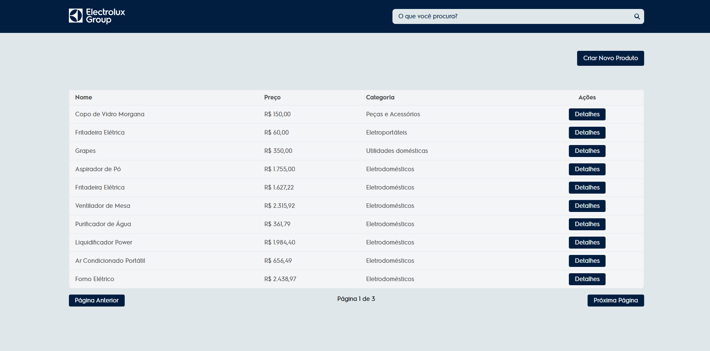
   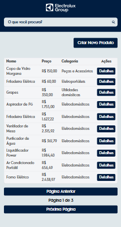
2. Filtragem de Produtos  
   Demonstração do filtro aplicado à tabela por nome de produto.
  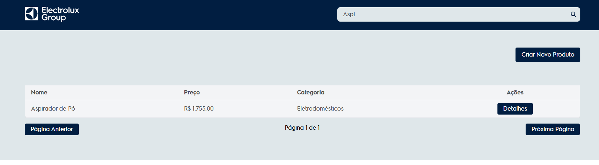
  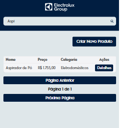
3. Modal de Detalhes do Produto  
   Mostra o modal exibindo informações detalhadas do produto, com botões para editar e deletar.
  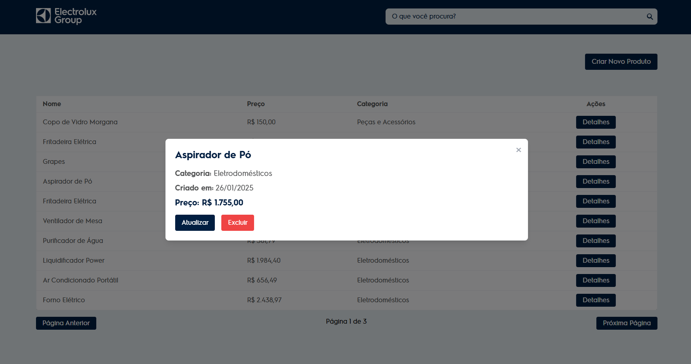
  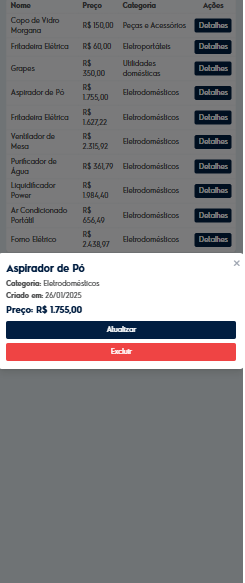
4. Formulário de Adição de Produtos  
   Tela para adicionar um novo produto, validando os campos antes do envio.
  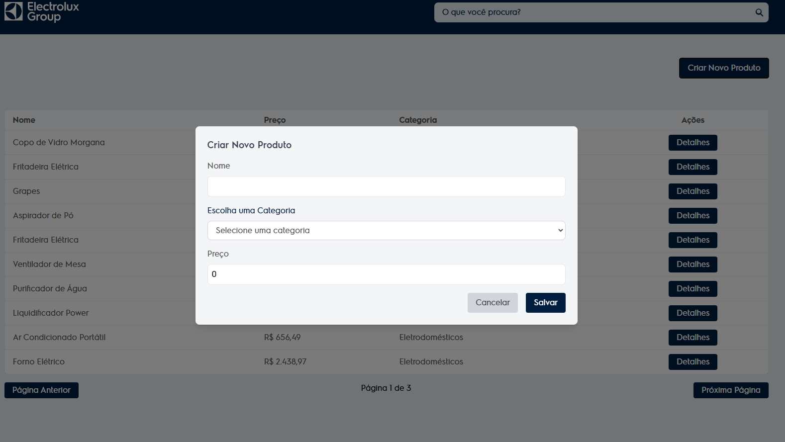
  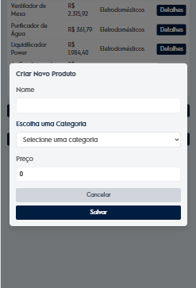
5. Feedbacks de Processos
  Modal com feedback da operação realizada.  
  
  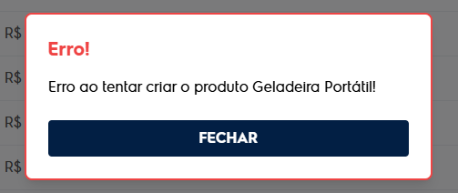
6. Paginação:
  Paginação da tabela de listagem de produtos
  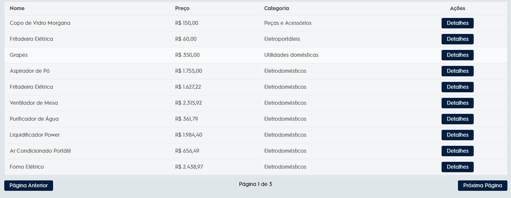
  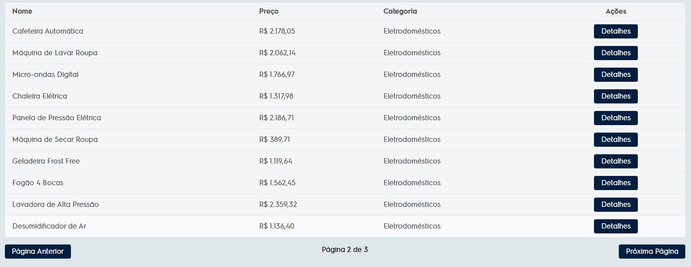
  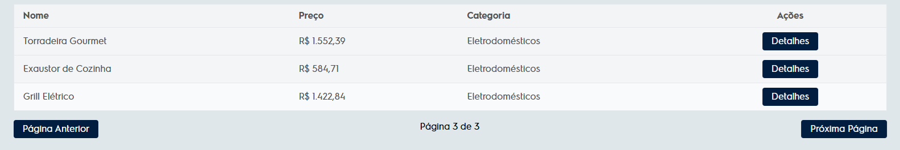

## Decisões Técnicas
- Organização do Projeto:
  - Componentes standalone reutilizáveis foram criados para modularizar a interface.
  - Criação de pipes personalizadas para correta renderização de valores numéricos.
  - Serviços centralizam a comunicação com a API.
  - Aplicação segue o padrão de arquitetura recomendado pela documentação do Angular.
- Estilo:
  - Framework escolhido para estilos foi o Tailwind CSS, priorizando design responsivo.
- Simulação de API:
  - JSON-server foi utilizado pela simplicidade e para evitar a necessidade de um backend robusto para a prova técnica.
  - Não foi usado IndexedDB ou LocalStorage, como alternativa.

## Funcionalidades Adicionais (Opcional)
- Paginação implementada na tabela de produtos.
- Formulário para atualizar o nome, categoria e preço de um produto dentro do modal de detalhes do produto.
- Botão para deletar um produto, com modal de confirmação acessível dentro do modal de detalhes do produto.
- As operações possuem feedbacks de sucesso ou fracasso, incluindo modais ou componentes que mostram o resultado dessa operação.

## Autor
Mateus Vinícius da Silva

[Linkedin](https://www.linkedin.com/in/mateus-vin%C3%ADcius-da-silva-8156301a5/)

[Github](https://github.com/Suetam94)

## Licença
Este projeto foi desenvolvido exclusivamente para fins de avaliação técnica e não possui uma licença específica.
